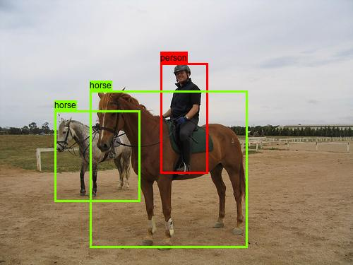
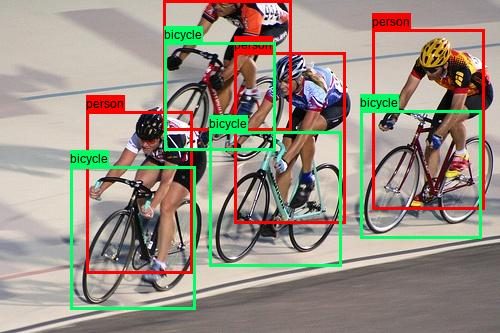

# YOLO v2 #
## Pytorch Implementation ##
***
</img>
</img>
## Requirements ##
***
* python 3.8.x
* pytorch 1.7.x
* pillow
* numpy
* tensorboard

## How to Use ##
***
* ### Clone the code
```
git clone https://github.com/tknzapper/yolo_v2.git
```

* ### Download training data
> From official site
> 
> [VOC2007](http://host.robots.ox.ac.uk/pascal/VOC/voc2007/)
> 
> [VOC2012](http://host.robots.ox.ac.uk/pascal/VOC/voc2012/)
> 
> Or
> ```
> # VOC2007
> wget http://host.robots.ox.ac.uk/pascal/VOC/voc2007/VOCtrainval_06-Nov-2007.tar
> wget http://host.robots.ox.ac.uk/pascal/VOC/voc2007/VOCtest_06-Nov-2007.tar
> wget http://host.robots.ox.ac.uk/pascal/VOC/voc2007/VOCdevkit_08-Jun-2007.tar
> 
> # VOC2012
> wget http://host.robots.ox.ac.uk/pascal/VOC/voc2012/VOCtrainval_11-May-2012.tar
> ```
> make directory 'data'
> and put all VOC data into the folder.
>
> ```
> # data/VOCdevkit/...
> ```

* ### Download pretrained weights for Darknet19 backbone
>   [darknet19.pth](https://drive.google.com/file/d/17rdAncS-Qzkz5N-Fmi4VGODfeDg7oLja/view?usp=sharing, "Download")
> 
> make directory 'weights/pretraied' and put pretrained file into the folder. 
> ```
> # weights/pretrained/darknet19.pth
> ```

* ### For Training
```
python train.py --[options] [val] --[options] [val] ...

--[options]
max_epochs              int        160
start_epoch             int        1
batch                   int        16
dataset                 str        voc07train, voc07trainval, voc0712trainval
nw                      int        8 number of workers to load training data
output_dir              str        'weights/model/'
use_tfboard             bool       using tensorboard
display_interval        int        10
mGPUs                   bool       False
save_interval           int        20
cuda                    bool       True
resume                  bool       False
checkpoint              int        resume epoch
exp_name                str        'runs' tensorboard log directory
```

* ### For Demo
```
python demo.py --[options] [val] --[options] [val] ...

--[options]
cuda                    bool       True
mGPUs                   bool       False
dataset                 str        voc07test
model                   str        trained weights file name
nw                      int        8
conf                    float      0.1 confidence threshold
nms                     float      0.4 nms threshold
```